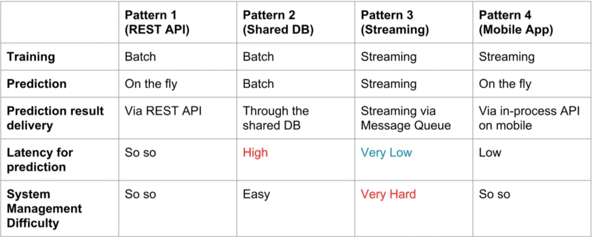

# DeploymentMachineLearningModels

## Requirement:

* some knowledge data science
* feature engineering and feature selection
* most common machine learning algorithms (linear and logistic regretion, and
random forest)
* how to evaluate the performance of the algorithms
* good python programming skills (numpy, pandas, scikit-learn)
* python environments
* git version control

## Definitions

* Pipeline: is a set of data processing steps connected in serioes, where typically, the output of one element is the input of the next one. The elements of a pipeline can be executed in parallel or in time-sliced fashion. This is useful when we require use of big data, or high computing power (neural networks).

## Machine learning pipeline: overview

1. Gathering data sources
2. Data analysis
3. Data Pre-processing - Feature engineering
4. Variable selection - Feature selection - finding the most predicting
variables and build the models using only those variables instead all the
dataset
5. Machine learning model building - choose one of the algorithms to use with
that have the best result.
6. Model building - create different model and evaluate the best one or few
ones.

Once done those steps we can talk about the model deployment.

## Machine learning pipeline: production

The steps of the ML pipeline we necessary want to deploy are 3, 4 and 5
(at least).

In production the pipeline change: 1, 3, 4 and 5 plus the last step formed by
probability and continuous output.

## Feature Engineering

The most common problems of data analisys are: the missing data, numerical type
data are represent as strings, type of distributions, unexpected values or
unusual.
Feature engineering need to solve this problems

## Feature Selection

Refers to the algorithms or procedures that allow us to find the best subsets
of features for all the variables present in our dataset.

At the end of this process we have a small number of features.

The most important thing to take care of is to make easy the implementation (
model production) by software developer of the features choosed.

Reduce features for model deployment:

* smaller json messages sent over to the model
* less lines of code for error handling
* less information log
* less feature engineering code

The feature selection methods are 3:

1. Embedded
2. Wrapper
3. Filter

## Meta ensembling

This is important to get models more precise. Simply merge more models into a
one ([more info here](https://www.gormanalysis.com/blog/guide-to-model-stacking-i-e-meta-ensembling/))

## Jupiter notebooks

Run the jupiter notebooks and do this:

[House Prices dataset: Data Analysis](mlpipeline_notes/02.6_ML_Pipeline_Step1-DataAnalysis.ipynb)

## Machine learning systems

ML in production requires multiple different components in order to work:

* Infrastructure
* Applications
* Data
* Documentation
* Configuration

All toghether these parts form the **system**.

These vary from simple web applications to incredibly complex pipelines built by hundreds of people.

The architecture is 'the way software componets are arranged and the interactions between them'. With the architecture we can describe the ML systems.

There are different challenges to consider when create a ML systems:

* The need for reproducibility
* Entanglement: the inputs may not be independents
* Data dependencies and not only code
* Configuration issues, make everithing flexible
* Data and feature preparation
* Model errors can be hard to detect with traditional tests

The contributors of the ML system are 4:

1. Data science
2. Software engineering
3. DevOps
4. Business

The research and the production environments are differents. the first one is separate from customer that facing software, can be done offline and sometimes require an infrastructure planning. In the other hand the production need the reproducibility of the software,

| | Research | Production |
| --- | --- |  --- |
| Customer facing software | Separate | Dependent |
| Reproducibility matters | Sometimes  | always |
| Infrastructure planning required | sometimes | always |

## Key principles for ML System architecture

* Reproducibility: ability to replicate a given ML prediction
* Automation: Retrain, update and deploy models as part of automated pipeline
* Extensibility: add and update models
* Modularity: feature code should be organized into clear pipelines
* Scalability: the model can be serve to different customers
* Testing: test variation between model versions

## General ML architectures

There are 4 typical architectures in use:

1. Train by batch, predict on the fly and serve via REST API.
2. Train by batch, predict by batch and then serve through a shared database
3. Train and predict by streaming
4. Train by batch , predict on mobile or other client

The most use and best in trade-off for most cases is the first type.

## High level architecture

* Data: represents the structure that provides access to the data sources
* Feature: creates features
* Scoring: trasform features into predictions
* Evaluation: monitors the equivalance of differents modules

## Reproducibility in ML

Reproducibility is the ability to duplicate a machine learning model exactly, such that given the same raw data as input, both models return the same output.

Reproducibility need to be confirmed for all the steps of [machine learning pipeline](#machine-learning-pipeline-:-overview) exept for data analysis.

## Production code

The production code is restricted for the 3, 4, 5 steps and is not done inside a **jupiter notebook**. We need to code to: create and transform features, incorporate the feature selection, build machine learning models, score new data. To write deployment code for ML is necessary to choose one of this programming methods: procedural, custom pipeline (object oriented), third party pipeline.

### Procedural Programming

In procedural programming, procedures, also known as routines, subrutines or functions, are carried out as a aseries of computational steps.

Using this method means to have:
* **Function script**: to store the functions or procedures to transform the feature, train the models and save the models for future use to make the prediction
* **Train script**: call all the function of the function script in order to engeneer features and train model
* **Score script**: as the train script we train the data but the output will be a score prediction
* **Yaml file**: hard code all the critical informations of the other scripts

| Advantages | Disadvantages |
| --- | --- |
| It can be done directly on jupyter notebook | Can get buggy |
| No software development skills required | Difficult to test |
| Easy to manually check if it reproduces the original model | Difficult to build software on top of it |
| --- | Need to save a lot of intermediate files to store the transformation parameters |

This is also not recommended for highly changeable project.

### Custom machine learning pipeline

Object-oriented programming we write code in the form of objects. This objects can store data and can also store instructions or procedures to modify that data.

A custom machine learning pipeline is therefore a sequence of steps, aimed at loading and transforming the data, to get it ready for training or scoring, where:

* write the processing steps as objects
* write the sequence, i.e., the pipeline as objects

| Advantages | Disadvantages |
| --- | --- |
| Can be tested, versioned, tracked and controlled | Requires team of software developers to build and maintain |
| Can build future models on top | Overhead for DS to familiarise with code for debugging or adding on future models |
| Good software developer practice | Preprocessor not reusable, need to re-write Preprocessor class for each new ML model |
| Built to satisfy business needs | Need to write new pipeline for each new ML model |
| --- | Lacks versatility, may constrain DS to what is available with the implemented pipeline |

### Scikit-learn and sklearn pipeline

Is a python library that provide solid implementation of a range of machine learning algorithms. Provides efficient version of a large number of common algorithms, most of its algorithms follow the same functionality.

Scikit-learn objects:

* **Transformers**: class that have fit and transform method, it transforms data.
* **Predictor**: class that has fit and predict methods, it fits and predicts.
* **Pipeline**: class that allows you to list an run transformers and predictors in sequence.

| Advantages | Disadvantages |
| --- | --- |
| Can be tested, versioned, tracked and controlled | Requires team of software developers to build and maintain |
| Can build future models on top | Overhead for software developers to familiarise with code for sklearn API (difficulties debugging) |
| Good software developer practice | --- |
| Leverages the power of acknowledged API | --- |
| Data scienteists familiar with Pipeline use, reduced over-head | --- |
| Engineering steps can be packaged and re-used in future ML models | --- |

## Feature selection in CI/CD

* Code: new model, model refresh
* Staging: tests
* Production: Model deployed, Automatically available to other systems

The advantages of using Continous Integration and Continous Deployment reduce the overhead in the implementation of the new model and also the new model is almost immediately available to the business systems. However this system is build in one dataset and is not versatile for other dataset sources.

